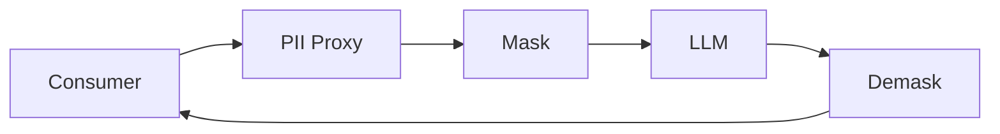

# PII Security Proxy

Модуль безопасности персональных данных между системой-потребителем и LLM.
Сервис идентифицирует ПД, маскирует их перед отправкой в LLM и восстанавливает
исходный текст после.

## 1. Что решает проект

Защищает персональные данные при передаче текста в LLM: маскирует ПД,
сохраняет состояние для восстановления и возвращает исходный текст после
обработки. Поддерживает разные правила для разных систем-потребителей.

## 2. Архитектурная схема



Подробнее: [docs/architecture.md](docs/architecture.md).

## 3. Quick Start

```bash
pip install -e ".[dev]"
uvicorn app.main:app --host 0.0.0.0 --port 8000
```

## 4. Запуск

```bash
uvicorn app.main:app --host 0.0.0.0 --port 8000
```

## 5. Docker запуск

```bash
docker compose up --build
```

## 6. curl для MASK

```bash
curl -X POST http://localhost:8000/process \
  -H "Content-Type: application/json" \
  -d '{"payload": "Напишите мне на test@example.com или +7 999 123-45-67", "payload_id": "example-1"}'
```

## 7. curl для DEMASK

```bash
curl -X POST http://localhost:8000/process \
  -H "Content-Type: application/json" \
  -d '{"payload": "<masked text>", "payload_id": "example-1"}'
```

## 8. Запуск тестов

```bash
pytest
```

Concurrency/slow/performance тесты исключены из обычного прогона:

```bash
pytest -m concurrency   # concurrency-тесты
pytest -m slow          # медленные pytest-сценарии
```

## 9. Запуск performance tests

Интерактивный режим:

```bash
locust -f tests/performance/locustfile.py --host http://localhost:8000
```

Headless-прогон с управлением целевым HTTP RPS. Runner проверяет healthcheck,
сохраняет CSV/JSON/Markdown и завершает работу с ошибкой, если фактический RPS,
p95/p99 или error rate не проходят заданные пороги:

```bash
python scripts/run_performance.py --host http://localhost:8000 \
  --targets 100,500,1000,2000 --scenario mixed
```

Доступные сценарии: `mask_only`, `roundtrip`, `mask_retry`, `demask_retry`,
`duplicate_payload`, `large_payload`, `mixed`. Результаты сохраняются в
`artifacts/performance/`. Числа 100/500/1000/2000 являются целевым RPS;
отчёт отдельно показывает фактически достигнутое значение.

## 9.1. Метрики

Технический endpoint `GET /metrics` отдаёт метрики в формате Prometheus
(`text/plain; version=0.0.4`). Он не меняет контракт `POST /process`.

```bash
curl http://localhost:8000/metrics
```

Метрики используют стандартные монотонные Prometheus Counter/Histogram,
раздельные buckets для latency в секундах и размера payload в байтах. В labels
не используются `payload`, `payload_id` или `request_id`.

## 9.2. CI

GitHub Actions workflow в `.github/workflows/ci.yml` запускает ruff, mypy,
pytest и валидацию submission ZIP на каждый push/PR.

## 9.3. Submission ZIP

```bash
python scripts/package_submission.py submission.zip
python scripts/package_submission.py --validate submission.zip
```

Сборщик создаёт детерминированный архив и исключает `.env*` (кроме
`.env.example`), VCS, виртуальные окружения, caches, performance artifacts и
предыдущие ZIP-файлы.

## 10. Как добавить новый PIIType

Добавьте значение в `PIIType` в `app/core/enums.py`. Затем укажите его в
`enabled_types` и `masking` в конфигурации consumer.

## 11. Как добавить новый Detector

Создайте класс, реализующий `PIIDetector` в `app/detection/base.py`, и
зарегистрируйте его в `DetectionEngine` в `app/api/dependencies.py`.

## 12. Как добавить MaskingStrategy

Создайте класс, реализующий `MaskingStrategy` в `app/masking/base.py`, и
зарегистрируйте его в `DefaultMaskingStrategyFactory`.

## 13. Как добавить consumer policy

Создайте YAML-файл в `configs/consumers/`. Имя файла становится
`consumer_id`.

## 14. Security considerations

См. [docs/security.md](docs/security.md). Чувствительные данные никогда не
логируются и не попадают в метрики.

## 15. Ограничения initial implementation

- Детекция построена на regex + валидаторах + маркерах (recall-first). Точность
  по типам измеряется локальным бенчмарком (`python -m benchmarks.score`), а не
  заявляется без измерений.
- In-memory хранилище состояния (один процесс) — для нескольких воркеров
  используйте Redis (`RESTORATION_STORE_BACKEND=redis`).
- Нет реального NER и внешнего LLM в hot path (LLM-детектор опционален и
  выключен по умолчанию).
- Rate limiting реализован (глобальный, возвращает 429 с `Retry-After`).
- Аутентификация/авторизация не реализованы.

## Настройка consumer (кратко)

Создайте YAML-файл в `configs/consumers/` с именем, равным `consumer_id`.
Укажите `enabled`, список `enabled_types`, стратегии `masking` для каждого
типа и флаг `demasking.enabled`. Перезапустите сервис, чтобы политика
загрузилась. Примеры: `default.yaml` и `demo.yaml`.

## Выбор consumer

По умолчанию используется `default` consumer. Для выбора другого consumer
передайте необязательный заголовок `X-Consumer-ID`:

```bash
curl -X POST http://localhost:8000/process \
  -H "Content-Type: application/json" \
  -H "X-Consumer-ID: demo" \
  -d '{"payload": "test@example.com", "payload_id": "example-1"}'
```

Неизвестный или отключённый consumer отклоняется с HTTP 403. Заголовок не
меняет обязательный JSON-контракт `POST /process`.

## Поддерживаемые типы ПД

EMAIL, PHONE, BANK_CARD, INN, PASSPORT_NUMBER, PASSPORT_DIVISION_CODE,
BIRTH_DATE, CVV, PIN, PERSON_NAME, BIRTH_PLACE, CITIZENSHIP, PASSPORT_ISSUER,
PASSPORT_ISSUE_DATE, DRIVER_LICENSE, ADDRESS, COUNTRY, POSTAL_CODE, CITY,
STREET, HOUSE, APARTMENT, CARDHOLDER_NAME.

## Качество детекции

```bash
python -m benchmarks.score
```

Отчёт показывает span-level precision/recall/F1 по каждому типу и в целом, а
также false positives на негативных кейсах. Не заявляйте качество 95% без
реального прогона этого бенчмарка.
