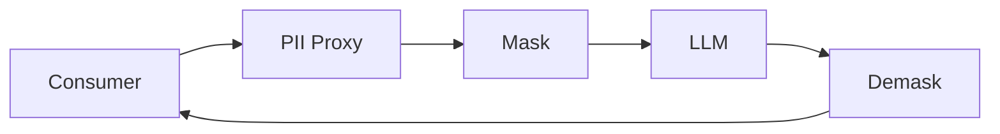

# PII Security Proxy

Модуль безопасности персональных данных между системой-потребителем и LLM.
Сервис идентифицирует ПД, маскирует их перед отправкой в LLM и восстанавливает
исходный текст после.

## 1. Что решает проект

Защищает персональные данные при передаче текста в LLM: маскирует ПД,
сохраняет состояние для восстановления и возвращает исходный текст после
обработки. Поддерживает разные правила для разных систем-потребителей.

## 2. Архитектурная схема



Подробнее: [docs/architecture.md](docs/architecture.md).

## 3. Quick Start

```bash
pip install -e ".[dev]"
uvicorn app.main:app --host 0.0.0.0 --port 8000
```

## 4. Запуск

```bash
uvicorn app.main:app --host 0.0.0.0 --port 8000
```

## 5. Docker запуск

```bash
docker compose up --build
```

## 6. curl для MASK

```bash
curl -X POST http://localhost:8000/process \
  -H "Content-Type: application/json" \
  -d '{"payload": "Напишите мне на test@example.com или +7 999 123-45-67", "payload_id": "example-1"}'
```

## 7. curl для DEMASK

```bash
curl -X POST http://localhost:8000/process \
  -H "Content-Type: application/json" \
  -d '{"payload": "<masked text>", "payload_id": "example-1"}'
```

## 8. Запуск тестов

```bash
pytest
```

## 9. Запуск performance tests

```bash
locust -f tests/performance/locustfile.py --host http://localhost:8000
```

## 10. Как добавить новый PIIType

Добавьте значение в `PIIType` в `app/core/enums.py`. Затем укажите его в
`enabled_types` и `masking` в конфигурации consumer.

## 11. Как добавить новый Detector

Создайте класс, реализующий `PIIDetector` в `app/detection/base.py`, и
зарегистрируйте его в `DetectionEngine` в `app/api/dependencies.py`.

## 12. Как добавить MaskingStrategy

Создайте класс, реализующий `MaskingStrategy` в `app/masking/base.py`, и
зарегистрируйте его в `DefaultMaskingStrategyFactory`.

## 13. Как добавить consumer policy

Создайте YAML-файл в `configs/consumers/`. Имя файла становится
`consumer_id`.

## 14. Security considerations

См. [docs/security.md](docs/security.md). Чувствительные данные никогда не
логируются и не попадают в метрики.

## 15. Ограничения initial implementation

- Обнаруживаются только EMAIL и PHONE (regex).
- In-memory хранилище состояния (один процесс).
- Нет реального NER, LLM, аутентификации и rate limiting.

## Настройка consumer (кратко)

Создайте YAML-файл в `configs/consumers/` с именем, равным `consumer_id`.
Укажите `enabled`, список `enabled_types`, стратегии `masking` для каждого
типа и флаг `demasking.enabled`. Перезапустите сервис, чтобы политика
загрузилась. Примеры: `default.yaml` и `demo.yaml`.