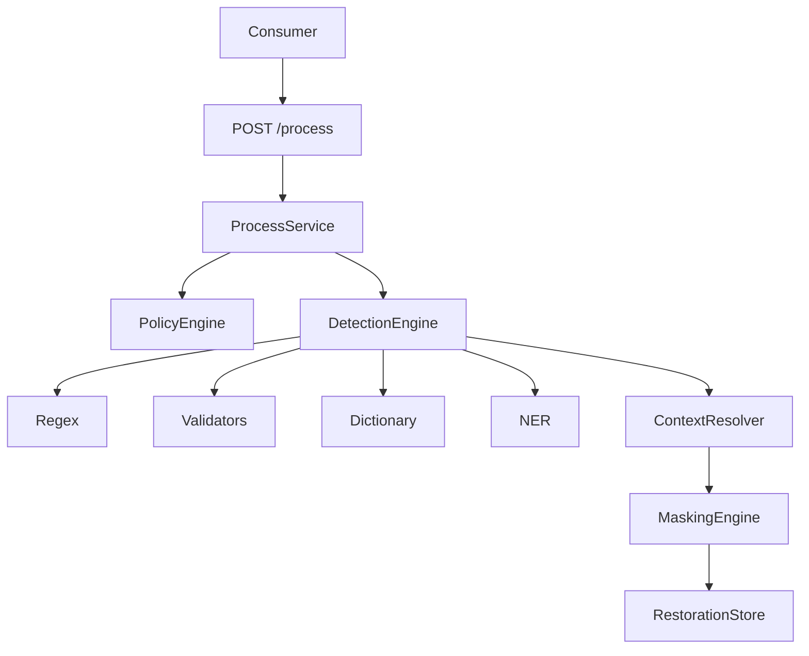

# Architecture

## Purpose

The PII Security Proxy sits between a consumer system and an LLM. It
identifies personal data, masks it before it reaches the LLM, and restores
the original text afterwards.

## Request lifecycle

## Production architecture

## Module responsibilities

| Module | Responsibility |
| --- | --- |
| `app/api` | HTTP routes, schemas, error handling |
| `app/core` | Domain models, enums, exceptions, security utilities |
| `app/detection` | Candidate detection and context resolution |
| `app/masking` | Masking strategies and engine |
| `app/restoration` | State storage for demasking |
| `app/policies` | Per-consumer policy loading |
| `app/processing` | ProcessService and SecureLLMPipeline |
| `app/llm` | LLM adapter abstraction |
| `app/observability` | Safe logging and metrics |
| `app/config` | Settings |

## Idempotency model

The operation (MASK vs DEMASK) is decided from the stored `RestorationState`,
not from a primitive "payload_id exists" check. This makes retries safe:

- New `payload_id` -> MASK, store state.
- Retry of the original payload -> same masked result.
- Request with the masked payload -> DEMASK, return original.
- Retry of the masked payload -> same original result.

The read-modify-write of the lifecycle is atomic through the store's
`transition` method: in-memory via a lock, Redis via an optimistic
compare-and-set (WATCH/MULTI). Two different original payloads racing on the
same new `payload_id` cannot both become owners; the loser receives a 4xx.

## Detection

The detector is a recall-first hybrid for Russian text: regex + validators
(Luhn, INN checksum, birth-date) + marker-anchored context patterns. It covers
all 23 required PII types. Unambiguous types (EMAIL, PHONE, BANK_CARD, INN,
PASSPORT_NUMBER, PASSPORT_DIVISION_CODE, BIRTH_DATE, CVV, PIN) are detected
directly; context-dependent types (PERSON_NAME, ADDRESS, CITY, STREET, etc.)
require a marker to avoid obvious false positives. Overlapping spans are
resolved by type priority and span length.

## Extension points

- New `PIIType` values in `app/core/enums.py`.
- New detectors implementing `PIIDetector` in `app/detection`.
- New masking strategies implementing `MaskingStrategy`.
- New consumer policies as YAML files in `configs/consumers`.
- `ChunkingStrategy` for large texts (up to 100k tokens).
- `RedisRestorationStore` to replace the in-memory store (required for
  multiple workers; select via `RESTORATION_STORE_BACKEND=redis`).

## Scaling

- Single worker: `InMemoryRestorationStore` (default).
- Multiple workers: set `RESTORATION_STORE_BACKEND=redis` and point
  `REDIS_URL` at a shared Redis. State is shared across workers so a mask in
  one worker can be demasked by another.
- Rate limiting is global (not per-IP) so load tests from one host are not
  falsely limited; 429 is a legitimate overload signal.